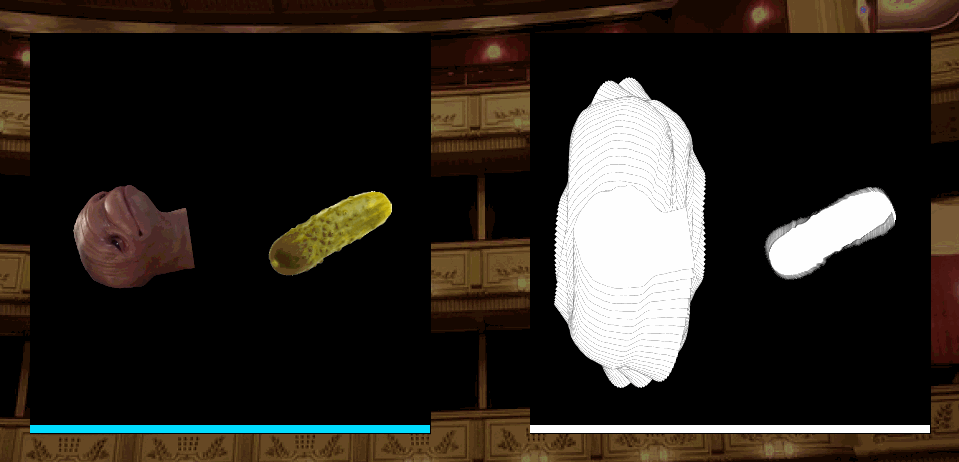
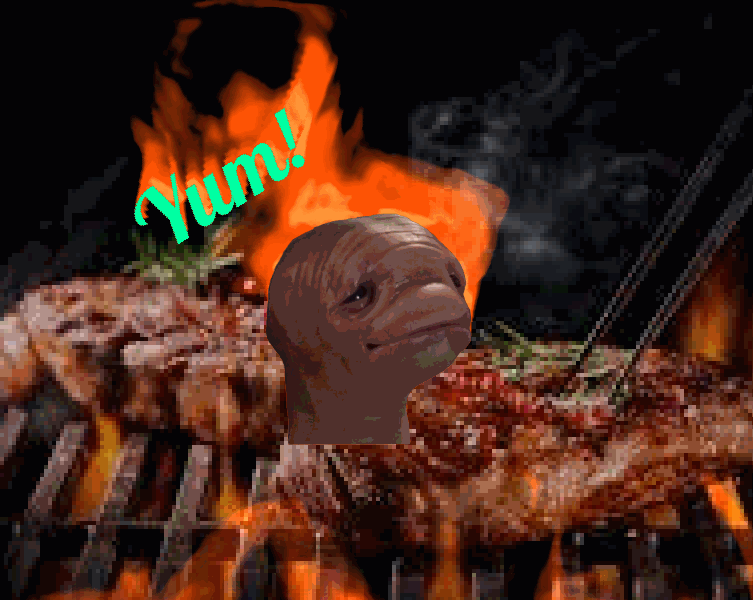

<center>
  
# **Procedurally rendered fire example for GameMaker: Studio**:fire:
### A brief example of using GLSL shader based fire effect in GameMaker: Studio heavily inspired & based from<br/>[**Hugo Elias'** article about fire effect](https://web.archive.org/web/20160418004150/http://freespace.virgin.net/hugo.elias/models/m_fire.htm) and [Video tutorial about it from **The Coding Train**](https://www.youtube.com/watch?v=X0kjv0MozuY)


</center>

Short list of features
====
- GLSL based fire rendering
- 2-pass Shader effect
- Adjustable shader settings like wind strength, usage of external noise texture
- There's also smoke comming out of it

Wait, Gamemaker?
====
Yeah! You're right, I used GameMaker for this example to show you that you can apply this effect to everything that supports GLSL shader.

How to use
====
If you're using GameMaker Studio 1, You can directly import the project in the folder `LIT_AF.gmx`.

There's few shaders that might make you tad bit confused, But no worries!<br>Here's the list of shaders that you want to export / copy & use it in your own projects:
- `shd_fire` is the one that calculates the fire
- `shd_fire_effect` and `shd_fire_effect_cartoon` makes the output from `shd_fire` more *Fire-ish* 
- everything else is miscellaneous shaders.

How it works
====
The original pseudocode goes like this :
```
loop forever

  loop y  from 1 to (ysize-2)                   ;Loop through all pixels on the screen, except
    loop x  from 1 to (xsize-2)                 ;the ones at the very edge.

      n1 = read pixel from buffer1(x+1, y)      ;Read the 4 neighbouring pixels
      n2 = read pixel from buffer1(x-1, y)
      n3 = read pixel from buffer1(x, y+1)
      n4 = read pixel from buffer1(x, y-1)

      c  = read pixel from CoolingMap(x, y)     ;Read a pixel from the cooling map

      p = ((n1+n2+n3+n4) / 4)                   ;The average of the 4 neighbours
      p = p-c                                   ;minus c

      if p<0 then p=0                           ;Don't let the fire cool below zero

      write pixel of value p to buffer2(x,y-1)  ;write this pixel to the other buffer
                                                ;notice that it is one pixel higher.

    end x loop
  end yloop

  copy buffer2 to the screen                    ;Display the next frame
  copy buffer2 to buffer1                       ;Update buffer1
  scroll CoolingMap up one pixel

end of loop
```

And here's how I achieved the effect :



*First, We draw the source image (left), full-white into our Fire buffer (right).*

**(We don't want to clear the Fire buffer, As we need the data from previous frame to calculate the next frame!)**


*Then, We Feed the Fire buffer into first shader(`shd_fire` in this example) and in that shader, We read it's red and blue channel, calculate fire & smoke from it and write it into red and blue channel of Fire buffer itself. (so we can use this on next frame)*

*After feeding the Fire buffer on the left, Now our Fire buffer looks like the one on the right.*

The process is quite simple;
- On each pixel, we get the average of red channel from it's four neighbor (top, left, bottom, right) -- We'll call this value `Intensity`<br>
(Also, We "scroll" the texture by getting the Intensity of pixel below.)<br>
`Intensity(x, y) = (Pixel(x - 1, y).r + Pixel(x + 1,y).r + Pixel(x, y - 1).r + Pixel(x, y + 1).r) / 4.0`
- We also get the brightness / red channel of our noise texture (cooling map) either fed in by sampler or generated in shader. -- We'll call this value `Cooling`<br>
(We "scroll" the cooling map as same way as Inteinsity, And The cooling map has to be adjusted a little bit for desired effect.)
- And we substract that value from cooling map, From value of `Intensity` we've got earlier. Also we limit the result so that it doesn't go below zero.<br>
`Fire = max(Intensity(x, y - 1) - Cooling(x, y - 1), 0.0)`
- After that, We write the result into the red channel of texture.<br>
`gl_FragColor.r = Fire`
- Same goes for Smoke, But we adjust the cooling map's value a little bit so that it spreads more & goes "dynamic". and we store that value into blue channel.
- I've offseted the sampling location of Intensity and Cooling map by few pixels so it emulates the effect of wind.


*And now we feed that result into yet another shader(`shd_fire_effect` in this example) and in that shader, We read it's red and blue channel (again) and use that for creating Fire-ish effect.*

*Top left : Fire data / red channel<br>Bottom left : Smoke data / Blue channel<br>Right : Composite result after feeding those into the shader*


*Now we can just plop the source image on it and there she goes, It's done & good to go.*

# Further readings
[Original technique by Hugo Elias](https://web.archive.org/web/20160418004150/http://freespace.virgin.net/hugo.elias/models/m_fire.htm)

[Video of implementing above in Processing by The Coding Train](https://www.youtube.com/watch?v=X0kjv0MozuY)

[Fluid simulation based Fire by Hugo Elias](https://web.archive.org/web/20160418004147/http://freespace.virgin.net/hugo.elias/models/m_ffire.htm)

["Warp feedback" which you could infuse with this to improve the visuals by Hugo Elias](https://web.archive.org/web/20160418004149/http://freespace.virgin.net/hugo.elias/graphics/x_warp.htm)

# Gallery



